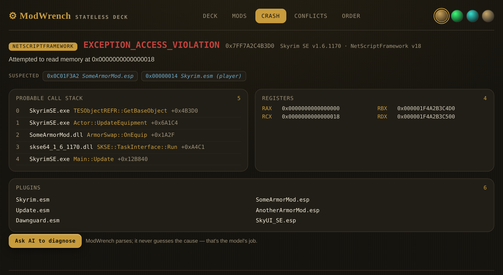
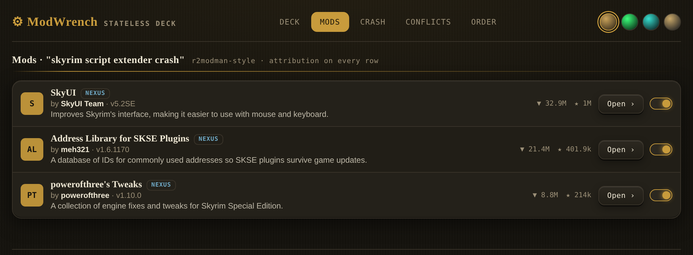

# ModWrench

[](https://github.com/171county/modwrench/actions/workflows/ci.yml)
[](https://www.npmjs.com/package/@modwrench/cli)
[](LICENSE)

An MCP server that connects your AI assistant to mod platforms and to your own modding setup, so you can ask questions in your AI client instead of clicking through web UIs.

It runs on your machine. No account, no service, no server anyone operates.

---

**Paste a crash log. Get the mod that caused it.**



`SomeArmorMod.esp` is named as a suspect, and `SomeArmorMod.dll` is sitting at frame 2 of
the call stack. ModWrench parsed the log and laid out what is in it. It did not decide the
cause — that is the model's job, and the panel says so.

**Search every platform you have connected, with the author on every row.**



These panels are not screenshots of a website. Each one is an interactive
[MCP-UI](https://mcpui.dev) resource that a tool returns inline with its answer — self-contained
HTML with no external scripts, no stylesheets, no fetches and no images. Your MCP client
renders it locally, or shows the text answer if it does not support MCP-UI yet. Nothing about
it reaches a server.

One caveat worth knowing before you hit it. A client that does not support MCP-UI does not
quietly ignore the panel — it puts the HTML into the conversation as text, and the model
reads markup it can do nothing with. One panel is about 28kb, roughly 8,800 tokens, near 7%
of a 128k context window. If that is happening to you, turn panels off:

```
MODWRENCH_UI=off
```

Set it wherever your client puts environment variables. The payload drops from 28kb to about
130 bytes — a 219x reduction — and every tool keeps working exactly as before. Panels are on
by default; this is opt-out, not opt-in.

---

## What it does

Four attachments. Install one, some, or all — `@modwrench/cli` composes whichever you've configured into a single MCP entry.

**Nexus Mods** — search mods, read changelogs and file lists, check versions, browse trending and recently updated, preview what's inside an archive before downloading, reverse-lookup a file by MD5, and endorse a mod when you ask it to. *(15 tools)*

**mod.io** — search and browse mods across the games mod.io hosts; pull mod details, files, tags, stats, dependencies and comments. *(17 tools)*

**Thunderstore** — browse communities, search mods, read full version history, and resolve dependency trees. No credential needed; the read API is public. *(9 tools)*

**Workbench** — local, on your machine. Find your installed games, mod managers and loaders; read your load order out of MO2, r2modman or Vortex; parse a crash log from Crash Logger SSE, Buffout 4, NetScriptFramework or BepInEx; look a mod up across platforms; check known conflicts. *(6 tools)*

The conflict check reads two sources: LOOT's masterlist, fetched live for Bethesda games, and a small conflict list bundled inside the package for games LOOT does not cover. **That bundled list ships empty** — all three files contain `[]` — so today it asserts nothing. It is named here because it is a channel that could carry claims about someone's mod in a future release, and `npx` pulls the latest version automatically unless you pin.

Plus two meta tools for activating a platform mid-session and opening a visual panel.

**49 tools. 48 of them read. One writes** — see [The one thing it writes](#the-one-thing-it-writes).

It also registers **five slash commands** your MCP client will offer you: `/modwrench` opens the panel, `/mw-find` searches every connected platform at once, `/mw-crash` takes a crash log, `/mw-conflicts` checks a game's load order, and `/mw-order` reads your load order. They are shortcuts that call the tools above — they add no capability the tools do not already have.

## How to use it

Requires Node.js 20 or newer.

**Claude Code**

```bash
claude mcp add --scope user modwrench -- npx -y @modwrench/cli
```

**VS Code** — open the Command Palette (`Ctrl+Shift+P`), run **MCP: Add Server**, choose
**Command (stdio)**, and enter `npx -y @modwrench/cli`. Letting VS Code write the config is
the reliable route, because its key is `servers` rather than the `mcpServers` other clients
use. If you would rather edit `mcp.json` by hand:

```json
{
  "servers": {
    "modwrench": {
      "type": "stdio",
      "command": "npx",
      "args": ["-y", "@modwrench/cli"]
    }
  }
}
```

MCP tools only load in **Agent** mode, not Ask — switch the mode dropdown in the chat box.

**Claude Desktop, Cursor, Cline, Continue, Roo Code** — add to your client's MCP config.
Note the key here is `mcpServers`, which is *not* what VS Code uses:

```json
{
  "mcpServers": {
    "modwrench": {
      "command": "npx",
      "args": ["-y", "@modwrench/cli"]
    }
  }
}
```

Restart your client. Thunderstore and the local Workbench tools work immediately — no account, no key.

### Connecting Nexus and mod.io

These two need a credential:

```bash
npx -y @modwrench/cli auth key nexus
npx -y @modwrench/cli auth key modio
```

Each command prompts for the key, verifies it against the platform, and stores it in your OS credential manager. Get them from [Nexus API access](https://www.nexusmods.com/users/myaccount?tab=api+access) and [mod.io/me/access](https://mod.io/me/access).

`auth status nexus` to check one, `auth logout nexus` to remove it.

> **Before you connect Nexus.** Nexus's [API Acceptable Use Policy](https://help.nexusmods.com/article/114-api-acceptable-use-policy) tolerates personal API keys for personal use, but asks public applications to register for their own client ID. ModWrench is not a registered Nexus application yet, so connecting Nexus means using your personal key with a third-party tool — and Nexus may choose to limit personal keys used that way. That would affect your key, not ModWrench. Skip Nexus if you'd rather not; nothing else depends on it.

## Your credentials

Your key lives in your operating system's credential manager — Windows Credential Manager, macOS Keychain, or libsecret on Linux. The server reads it from there and nowhere else: there is no `.env` path, no config-file path and no environment-variable path in the credential loader. If the credential manager is empty or unreachable, ModWrench stops and tells you why instead of looking elsewhere.

The key is read when its platform activates — at start-up, or mid-session if you activate one later — and held in memory until the process exits. The cross-platform lookup `mw_query_mod_metadata` re-reads it from the credential manager on each call.

The only things that ever write a credential are `auth key` and `auth login`, which put it into that same credential manager; `auth logout` removes it. Nothing writes it to a file.

You can revoke or rotate it on Nexus or mod.io whenever you want. There is nothing to clean up on this end.

## What it connects to

Everything ModWrench talks to, and nothing else:

| Host | When |
|---|---|
| `api.nexusmods.com` | Nexus mod data — only if you connected Nexus |
| `users.nexusmods.com` | only while `auth login nexus` completes an OAuth sign-in |
| `api.mod.io` | mod.io mod data — only if you connected mod.io |
| `thunderstore.io` | Thunderstore's public read API |
| `raw.githubusercontent.com` | LOOT's public conflict masterlist |
| `127.0.0.1` | a local listener that catches the OAuth redirect, during `auth login` only |
| whatever CDN host Nexus names in a file's `content_preview_link` | `nexus_file_preview` only — Nexus serves archive listings off-API, so this one call follows a URL Nexus returns rather than a fixed host. Sent with no credential |

Other domains show up in ModWrench's *output* — `www.nexusmods.com` and `mod.io` links back to mod pages — but it does not fetch them. Your browser does, if you click one.

No telemetry. No analytics. No accounts. Nothing is sent to us, because there is no us to send it to — no server is run for this project.

## The one thing it writes

`nexus_endorse_mod` endorses a mod on Nexus, as you, on your account. It is the only tool in ModWrench that changes anything on any platform.

It cannot fire by accident. Ask for an endorsement and the first thing back is a preview — which mod, which version, and a note that the endorsement is public and shows your username. **No network call happens at all unless you confirm.** Only a second, explicitly confirmed call sends it. There's a test asserting the unconfirmed path touches the network zero times.

Everything else reads.

Locally, the Workbench tools open files read-only. There is no filesystem write call anywhere in the package.

## For mod authors

Every output built from a platform's data carries your name, the platform it came from, and a link to your mod page. That covers all the search, browse and lookup tools across Nexus, mod.io and Thunderstore.

There is one place it does not, and it is the place that matters most to you, so it gets said plainly rather than left for you to find. **The crash and conflict tools can name your mod without linking to you.** `mw_diagnose_crash` reads a crash log off the user's own disk and reports the plugin filenames it finds; `mw_check_known_conflicts` reports pairs from LOOT's masterlist. Both work from filenames, not platform records — ModWrench genuinely does not know which platform a given `.esp` came from, and finding out would mean a network lookup for every suspect in a local diagnostic that otherwise touches nothing.

So those two tools are the ones that can make a negative statement about your work — "this mod is the likely cause" — to a user who has no link back to you. Both carry a disclaimer saying the finding is a suspicion from a log, not a verdict. That is not the same as attribution, and until it can be done without turning a local tool into a networked one, this is a gap and it is listed as one.

Where a platform reports an author's permissions, ModWrench passes them through so you see them. It does not enforce them and cannot — this is a metadata bridge, not a gate. What it will not do is help you strip a credit.

The endorse tool exists for the same reason: it's the one way a bridge like this gives something back to the person who made the thing, rather than only taking a page visit away.

## Status

Early — pre-1.0. It will have bugs, and it is not perfect.

The source is open so you can check anything on this page rather than taking it on faith. [TRUST.md](TRUST.md) lists each claim with the command to verify it yourself. If you find one that isn't true, that's a bug — [file it](https://github.com/171county/modwrench/issues).

## License

MIT
