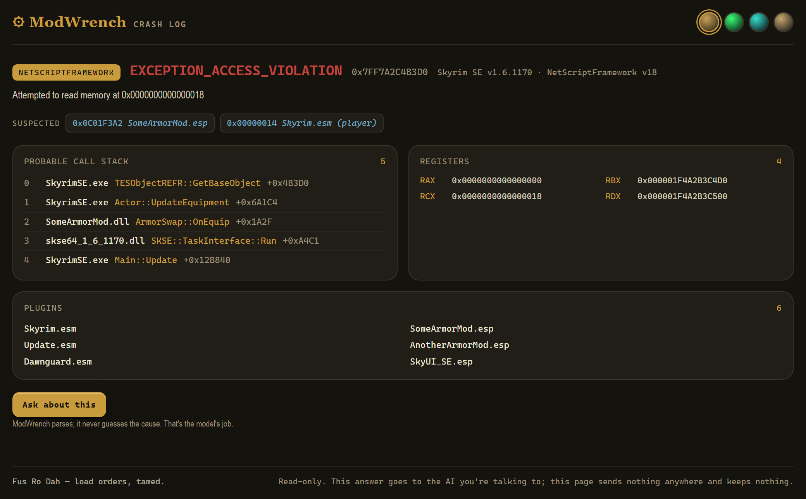
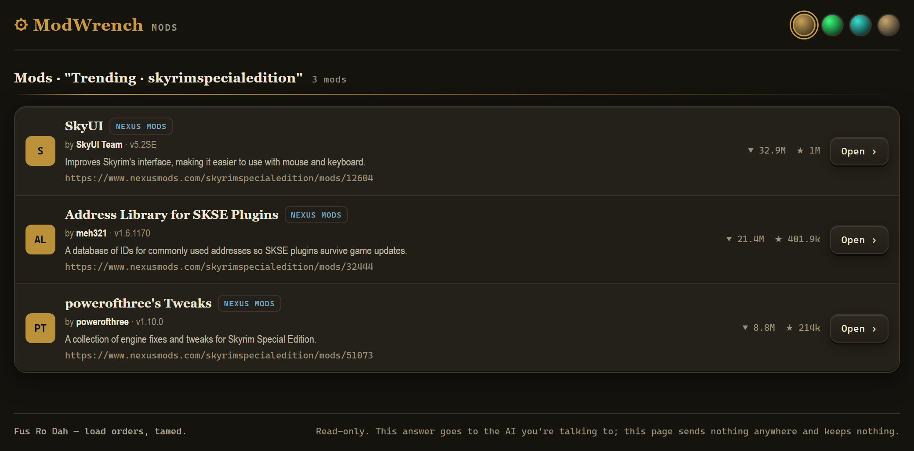

# ModWrench

[](https://github.com/171county/modwrench/actions/workflows/ci.yml)
[](https://www.npmjs.com/package/@modwrench/cli)
[](LICENSE)

An MCP server that connects your AI assistant to mod platforms and to your own modding setup, so you can ask questions in your AI client instead of clicking through web UIs.

It runs on your machine. No account, no service, no server anyone operates.

---

**Paste a crash log. Get the mod that caused it.**



`SomeArmorMod.esp` is named as a suspect, and `SomeArmorMod.dll` is sitting at frame 2 of
the call stack. ModWrench parsed the log and laid out what is in it. It did not decide the
cause — that is the model's job, and the page says so.

**Search every platform you have connected, with the author on every row.**



These are not screenshots of a website. Each is an
[MCP Apps](https://apps.extensions.modelcontextprotocol.io/api/documents/overview.html) page:
one self-contained HTML document with no external scripts, no stylesheets, no fetches and no
images. Every tool answers in text that any client can show and a model can read. Crash logs,
mod lists, dependencies and load orders, known conflicts, the deck, Patch Day, Crash Whisperer
and the Doctors also have a page, drawn only in a client that supports MCP Apps: the tool
points at its page, the client fetches it and draws it, and the data the page draws comes with
the answer as structured data. A client that can't draw pages never fetches one and is never
sent that data, so it gets the text answer and no HTML at all. The pictures above were drawn in
a stand-in for an MCP Apps host; no page has been tried in a real client yet.

**Patch Day, Crash Whisperer and the Doctors** (`mw_patch_day`, `mw_crash_whisperer`,
`mw_doctor`) keep their text to a few lines, and the full report goes to their page. The
structured data goes only to clients that say they can draw pages, because some clients hand
the model the structured data *instead of* the text, which would turn a ten-line answer into a
long one. If you want it anyway, for a script or an agent that reads it, set
`MODWRENCH_STRUCTURED=always`; `MODWRENCH_STRUCTURED=never` sends it to nobody, and then no
tool points at a page, since without its data a page could only repeat the text answer.
`MODWRENCH_UI=off` switches every page off, and with them the structured data, unless
`MODWRENCH_STRUCTURED=always` asks for it. The pages make no network requests and keep
nothing; [TRUST.md](TRUST.md#the-patch-day-page) and
[the other pages](TRUST.md#the-other-pages) say what they can and can't do.

The optional HTTP server, `@modwrench/remote`, decides the same way. It keeps a session for
each client (in memory only; nothing is written, and a session left unused for 24 hours is
closed), so the server answering a tool call is the one that saw whether the client draws
pages, and its Thunderstore mod lists and dependency tools send a page's data only to clients
that do. A client whose session was closed gets "Session not found" until it reconnects.

**The Doctors** (`mw_doctor`, or `/mw-doctor`) answer "is my setup ready?", and they are the
boring half of modding support: a lot of "my mods keep breaking" threads end with a cause that
isn't a mod. The Setup Doctor looks at where the game, Mod Organizer 2 and Vortex's staging folder
live (Program Files, OneDrive and the other folders Windows protects or syncs), whether Vortex's
staging folder is on the game's drive as its hard links need, how much room is left on the drive,
and, for Skyrim Special Edition and Fallout 4, the plugin list: plugins whose master is missing, switched off
or loaded too late, the limit of 254 full and 4,096 light plugins, entries for plugins that are
gone, Mod Organizer 2 and the game's own list disagreeing, clutter in MO2's Overwrite folder, and
crash loggers (none, or two that fight). The Deck Doctor, on Linux and the Steam Deck, looks at
which Steam holds the game (regular or Flatpak), whether Proton has made the game's prefix,
BepInEx's `winhttp` launch override, which app opens `nxm://` links, whether a library sits on an
NTFS, FAT32 or exFAT drive, and folder names that differ only by capital letters. Every finding says
what it rests on (your files, a documented rule with its source named, or ModWrench's own
guess), and the report lists what it can't see: antivirus, the pagefile, what MO2's virtual file
system shows the game while it runs. Why a game crashed is Crash Whisperer's question, and the
report says so. It is read-only and local: no network, no program started,
nothing written, no folder path in the answer. A clear report means the checks that can run
from files passed. It does not mean the game starts, and it says so. It was built from the tools'
own documentation and tested on constructed installs; it has not been run against a real one.
[TRUST.md](TRUST.md#the-doctors-what-they-open) lists what it opens and where it is unsure.

**Crash Whisperer** (`mw_crash_whisperer`, or `/mw-crash`) answers "why did my game
crash?". Ask with nothing else and it reads the newest crash log your logger wrote (or the
one you point at or paste), says in plain words what happened, and ranks the names the log
points at, each with its reasons and a label for what the reason rests on: the log, your
files, a published rule, or ModWrench's own guess. It checks your setup for the usual causes,
compares your other recent Crash Logger SSE and Buffout 4 crash logs to see whether the same
name keeps coming up, and writes
the post you'd put on a forum, GitHub or Discord, or send to the mod's author, with the
personal details it recognises (your name, computer name, folders, addresses, keys) taken
out. That is pattern matching, so it can miss something: read a post before you send it.
Besides the call stack, a post carries what the log names: the objects the logger lists and
the plugins that changed them, the game files, Papyrus functions and object types named in
the registers and stack, a NetScriptFramework log's DLL list, and BepInEx's, Unity's and
each plugin's version. When the log has no plugin list, or the logger couldn't write one,
the post says so, and where the logger couldn't write it the post leaves a blank for your
load order. A ranking is a lead, never a verdict, and it never calls anything safe. It says
what the log shows the game was working with (the objects it lists, game files, the kinds of
object in the registers, Papyrus functions), and when the game stopped inside a library
other mods need, such as RaceMenu or JContainers, it says not to remove it and points at the
mod that may have called it, when the log shows one. When no name stands out, it suggests the
Doctors, which check the setup problems a crash log may not name. It reads Crash Logger
SSE, Buffout 4, NetScriptFramework and BepInEx logs; the setup check covers Skyrim Special
Edition for now. Reading the log from your disk is the private way to use it: what it
recognises comes out before anything reaches your AI. A log you paste into the chat, or a
path you type, has already reached it as you typed it, and the log file itself is never
cleaned, so share a help post and not the file.
[TRUST.md](TRUST.md#crash-whisperer-what-it-opens) has the rest, including a plain list of what
it does not catch.

---

## What it does

Four attachments. Install one, some, or all — `@modwrench/cli` composes whichever you've configured into a single MCP entry.

**Nexus Mods** — search mods, read changelogs and file lists, check versions, browse trending and recently updated, preview what's inside an archive before downloading, reverse-lookup a file by MD5, and endorse a mod when you ask it to. *(15 tools)*

**mod.io** — search and browse mods across the games mod.io hosts; pull mod details, files, tags, stats, dependencies and comments. *(17 tools)*

**Thunderstore** — browse communities, search mods, read full version history, and resolve dependency trees. No credential needed; the read API is public. *(9 tools)*

**Workbench** — local, on your machine. Find your installed games, mod managers and loaders; read your load order out of MO2, r2modman or Vortex; parse a crash log from Crash Logger SSE, Buffout 4, NetScriptFramework or BepInEx, or have it explained: what happened, which names the log points at and how sure that is, and a help post ready to copy; look a mod up across platforms; check known conflicts; check, before or after a game patch, whether your script extender plugins will survive it (SKSE for Skyrim Special Edition and Anniversary Edition, F4SE for Fallout 4); and run the Doctors, a read-only health check of the setup behind the crash (plugin masters and limits, where things live, MO2's Overwrite folder, and on Linux and the Steam Deck the Steam, Proton and `nxm://` side). *(9 tools)*

The conflict check reads two sources: LOOT's masterlist, fetched live for Bethesda games, and a small conflict list bundled inside the package for games LOOT does not cover. **That bundled list ships empty** — all three files contain `[]` — so today it asserts nothing. It is named here because it is a channel that could carry claims about someone's mod in a future release, and `npx` pulls the latest version automatically unless you pin.

Plus three meta tools: one activates a platform mid-session, one opens the deck, which shows which platforms are connected (a page in clients that support MCP Apps, the connector list as text everywhere else), and one drafts feedback for ModWrench's maintainers as a GitHub issue that you read and post yourself (it sends nothing).

**53 tools. 52 of them read. One writes** — see [The one thing it writes](#the-one-thing-it-writes).

It also registers **eight slash commands** your MCP client will offer you: `/modwrench` opens the deck, `/mw-find` searches every connected platform at once, `/mw-crash` asks why your game crashed (it reads your newest crash log itself), `/mw-conflicts` checks a game's load order, `/mw-order` reads your load order, `/mw-patch` asks whether a game update is safe, `/mw-doctor` asks whether your setup is ready, and `/mw-critique` drafts feedback for the maintainers. They are shortcuts that call the tools above — they add no capability the tools do not already have.

## How to use it

Requires Node.js 20 or newer.

**Claude Code**

```bash
claude mcp add --scope user modwrench -- npx -y @modwrench/cli
```

**VS Code** — open the Command Palette (`Ctrl+Shift+P`), run **MCP: Add Server**, choose
**Command (stdio)**, and enter `npx -y @modwrench/cli`. Letting VS Code write the config is
the reliable route, because its key is `servers` rather than the `mcpServers` other clients
use. If you would rather edit `mcp.json` by hand:

```json
{
  "servers": {
    "modwrench": {
      "type": "stdio",
      "command": "npx",
      "args": ["-y", "@modwrench/cli"]
    }
  }
}
```

MCP tools only load in **Agent** mode, not Ask — switch the mode dropdown in the chat box.

**Claude Desktop, Cursor, Cline, Continue, Roo Code** — add to your client's MCP config.
Note the key here is `mcpServers`, which is *not* what VS Code uses:

```json
{
  "mcpServers": {
    "modwrench": {
      "command": "npx",
      "args": ["-y", "@modwrench/cli"]
    }
  }
}
```

Restart your client. Thunderstore and the local Workbench tools work immediately — no account, no key.

### Connecting Nexus and mod.io

These two need a credential:

```bash
npx -y @modwrench/cli auth key nexus
npx -y @modwrench/cli auth key modio
```

Each command prompts for the key, verifies it against the platform, and stores it in your OS credential manager. Get them from [Nexus API access](https://www.nexusmods.com/users/myaccount?tab=api+access) and [mod.io/me/access](https://mod.io/me/access).

`auth status nexus` to check one, `auth logout nexus` to remove it.

> **Before you connect Nexus.** Nexus's [API Acceptable Use Policy](https://help.nexusmods.com/article/114-api-acceptable-use-policy) tolerates personal API keys for personal use, but asks public applications to register for their own client ID. ModWrench is not a registered Nexus application yet, so connecting Nexus means using your personal key with a third-party tool — and Nexus may choose to limit personal keys used that way. That would affect your key, not ModWrench. Skip Nexus if you'd rather not; nothing else depends on it.

## Your credentials

Your key lives in your operating system's credential manager — Windows Credential Manager, macOS Keychain, or libsecret on Linux. The server reads it from there and nowhere else: there is no `.env` path, no config-file path and no environment-variable path in the credential loader. If the credential manager is empty or unreachable, ModWrench stops and tells you why instead of looking elsewhere.

The key is read when its platform activates — at start-up, or mid-session if you activate one later — and held in memory until the process exits. The cross-platform lookup `mw_query_mod_metadata` re-reads it from the credential manager on each call.

The only things that ever write a credential are `auth key` and `auth login`, which put it into that same credential manager; `auth logout` removes it. Nothing writes it to a file.

You can revoke or rotate it on Nexus or mod.io whenever you want. There is nothing to clean up on this end.

## What it connects to

Everything ModWrench talks to, and nothing else:

| Host | When |
|---|---|
| `api.nexusmods.com` | Nexus mod data, and crash-suspect attribution when you opt in — only if you connected Nexus |
| `users.nexusmods.com` | only while `auth login nexus` completes an OAuth sign-in |
| `api.mod.io` | mod.io mod data — only if you connected mod.io |
| `thunderstore.io` | Thunderstore's public read API |
| `raw.githubusercontent.com` | LOOT's public conflict masterlist |
| `127.0.0.1` | a local listener that catches the OAuth redirect, during `auth login` only |
| whatever CDN host Nexus names in a file's `content_preview_link` | `nexus_file_preview` only — Nexus serves archive listings off-API, so this one call follows a URL Nexus returns rather than a fixed host. Sent with no credential |

Other domains show up in ModWrench's *output* — `www.nexusmods.com` and `mod.io` links back to mod pages — but it does not fetch them. Your browser does, if you open one. On the Mods page, Open asks your AI client to open a mod's page, and your client decides.

No telemetry. No analytics. No accounts. Nothing is sent to us, because there is no us to send it to — no server is run for this project.

## The one thing it writes

`nexus_endorse_mod` endorses a mod on Nexus, as you, on your account. It is the only tool in ModWrench that changes anything on any platform.

It cannot fire by accident. Ask for an endorsement and the first thing back is a preview — which mod, which version, and a note that the endorsement is public and shows your username. **No network call happens at all unless you confirm.** Only a second, explicitly confirmed call sends it. There's a test asserting the unconfirmed path touches the network zero times.

Everything else reads.

Locally, the Workbench tools open files read-only. There is no filesystem write call anywhere in the package.

## For mod authors

Every output built from a platform's data carries your name, the platform it came from, and a link to your mod page. That covers all the search, browse and lookup tools across Nexus, mod.io and Thunderstore.

There is one place it does not, and it is the place that matters most to you, so it gets said plainly rather than left for you to find. **The crash and conflict tools work from filenames, not platform records.** `mw_diagnose_crash` reads a crash log off the user's own disk and reports the plugin filenames it finds; `mw_check_known_conflicts` reports pairs from LOOT's masterlist. ModWrench does not inherently know which platform a given `.esp` came from — finding out means network lookups in a diagnostic that otherwise touches nothing.

That gap is now half-closed, and only ever on request: `mw_diagnose_crash` takes an opt-in `attributeSuspects` flag (off by default) that resolves up to **five** named suspects to their Nexus mod pages — author, link, and the name the search matched, so a mismatch can be spotted before the link is presented as yours. It is a name search, it can be wrong, and every attribution it returns says so (`matchedBy: "name-search"`). It needs a `gameId` and a stored Nexus credential; without them it says attribution was skipped and moves on. `mw_check_known_conflicts` still does not attribute — LOOT's masterlist carries no author pages.

A crash diagnosis can still make a negative statement about your work — "this mod is the likely cause" — with no link back to you when attribution is off (the default), unavailable, or fails to match. Every finding carries a disclaimer saying it is a suspicion from a log, not a verdict. Attribution narrows the gap; it does not close it — the conflict tool has no author data to draw on at all, and that remains a gap and is listed as one.

Where a platform reports an author's permissions, ModWrench passes them through so you see them. It does not enforce them and cannot — this is a metadata bridge, not a gate. What it will not do is help you strip a credit.

The endorse tool exists for the same reason: it's the one way a bridge like this gives something back to the person who made the thing, rather than only taking a page visit away.

## Status

Early — pre-1.0. It will have bugs, and it is not perfect.

The source is open so you can check anything on this page rather than taking it on faith. [TRUST.md](TRUST.md) lists each claim with the command to verify it yourself. If you find one that isn't true, that's a bug — [file it](https://github.com/171county/modwrench/issues).

## License

MIT
